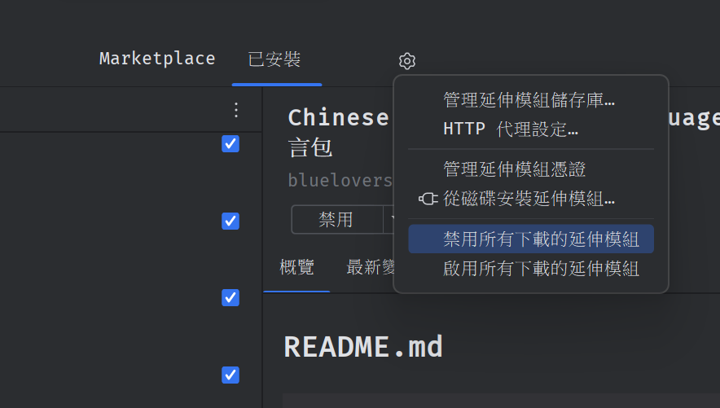

# 1-1 環境架設

## 課程目標

設置開發環境，讓各位先模索一下IDEA

***

### 步驟一: 下載JDK

請下載Java 17的JDK，這是Minecraft 目前在使用的Java版本



### 步驟二:下載並安裝IDEA



### 步驟三:插件安裝

打開IDEA，打開Settings>> Plugins >> 安裝Minecraft開發者插件



### 步驟四:安裝IDEA中文化插件

下載連結:



接著打開IDEA，然後打開延伸模組管理介面，接著選擇設定圖標 >> 從磁碟安裝延伸模組

<figure><figcaption></figcaption></figure>

